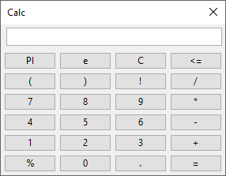

# racket-calculator
Creating a test calculator for testing Racket GUIs

## Features
- [x] GUI controls
- [x] Basic expression evaluation
- [x] Order of Operations
- [ ] Constants (PI, e)
- [ ] Unary operators
- [ ] Paren groups
